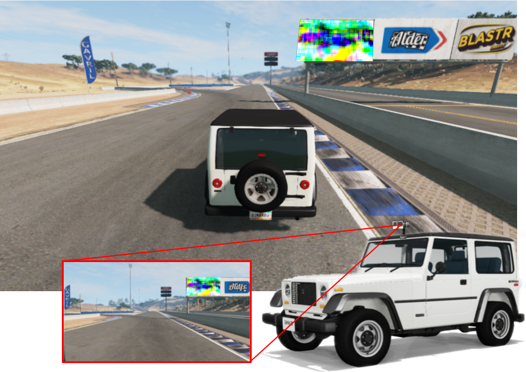

# DeepManeuver:  Adversarial Test Generation for Trajectory Manipulation of Autonomous Vehicles



Adversarial test generation techniques aim to produce input perturbations that cause a DNN to compute incorrect outputs as part of a validation framework.
For autonomous vehicles driven by a DNN, however, such perturbations are likely to be ineffective due to the vehicle attenuating their effect (i.e., physical limitations or bound-checks on steering angles) and the changing vehicle state (i.e., new images  are not susceptible to the same perturbation).
In this work we argue that for adversarial perturbations to be effective on autonomous vehicles they must account for the subtle interplay between the DNN and the vehicle states. 
Building on that insight, we develop DeepManeuver, a framework that interleaves adversarial test generation with the vehicle trajectory simulation. Through such integration, as the  vehicle moves along a trajectory, DeepManeuver enables the refinement of candidate perturbations to: 
1. account for changes in the state of the vehicle that may affect how the perturbation is perceived by the system, 
2. retain the effect of perturbation on previous states so that the current state can still be reached by the vehicle,
3. result in maneuvers that require particular vehicle state sequences (i.e, crashing against an obstacle, taking a fast tight turn). 

Our assessment of DeepManeuver reveals that it can generate perturbations that are much more effective and consistent than state-of-the-art techniques by 277% compared to the best-performing baseline.
We also show DeepManeuver effectiveness at disrupting vehicle behavior to achieve multi-objective maneuvers with 52% success.


# Installation

## BeamNG Simulator

This application of DeepManeuver requires the BeamNG driving simulator to simulate the environment and vehicle. 
We use BeamNG.research.v1.7.0.1. A license and link to download and installation instructions can be requested from BeamNG [here](https://register.beamng.tech/).

## Python requirements

```bash
python3.8 -m venv .venv
. .venv/bin/activate
pip install -r requirements.txt
```

# Running the techniques

## Running DeepManeuver

```python

```

## Running Deepbillboard without the simulator
```bash
python -m deepbillboard dave.onnx sequences/Digital/digital_Udacity_straight1/ --direction=right
```

This will output results to `./samples/digital_Udacity_straight1`. 
The file `arrows.png` shows all of the images in the sequence with modified signs, and with arrows representing the predicted steering angles (blue for original, green for adversarial).
`pert_i.png` shows what the sign should look like after iteration `i`, and `pert_imgs_i.png` shows the images in the sequence with the modified sign at iteration `i`.

## Sequences

