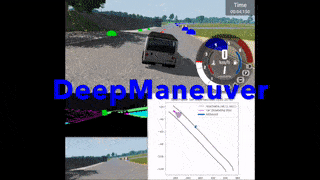

# DeepManeuver:  Adversarial Test Generation for Trajectory Manipulation of Autonomous Vehicles


Adversarial test generation techniques aim to produce input perturbations that cause a DNN to compute incorrect outputs.
For autonomous vehicles driven by a DNN, however, the effect of such perturbations are attenuated by other parts of the system
and not as effective as the  vehicle state changes.
In this work we argue that for adversarial perturbations to be effective on 
autonomous vehicles they must account for the subtle interplay between the DNN and the vehicle states.
Building on that insight, we develop DeepManeuver, an automated framework that interleaves adversarial test generation with the vehicle trajectory simulation. 
Through such integration, as the  vehicle moves along a trajectory, DeepManeuver enables the refinement of candidate perturbations to: 
(1) account for changes in the state of the vehicle that may affect how the perturbation is perceived by the system, 
(2) retain the effect of the perturbation on previous states so that the current state can still be reached by the vehicle,
(3) result in multi-objective maneuvers that require particular vehicle state sequences (i.e, crashing against an obstacle, taking a fast tight turn).

Our assessment of DeepManeuver reveals that it can generate perturbations that force maneuvers more effectively than state-of-the-art techniques by 419% on average.
We also show DeepManeuver effectiveness at disrupting vehicle behavior to achieve multi-objective maneuvers with a minimum 52% rate of success.

# Examples



The above gif shows an example run of DeepManeuver.
The ego vehicle navigates along the center of the road towards the attack surface, a billboard on the left-hand side of the road.
Semantic segmentation in the lower left corner shows the boundaries of the attack surface.
Below that, the image shows what the onboard camera sees, i.e., the image collected by the perception system collects at each simulation step.
Once the cut-on is reached, DeepManeuver begins to collect images and steering angles from the simulator, generating a new perturbation at each step.
In the lower left corner, you can observe the appearance of the attack surface changing at each step.
The vehicle starts to turn as the perturbation takes effect.
Once the reachable set, shown in the lower left corner, overlaps with the road by 60% or less, the generation phase stops.
This cut-off of 60% was determined during normal navigation around the track, as 60% is the lowest reachable set overlap during normal navigation.
Then, the final perturbation is injected into the simulator, and the test phase begins.
As can be seen during the test phase, the effect of the perturbation is similar to the generation phase, and the test ends in a crash.

# Installation

## BeamNG Simulator

This application of DeepManeuver requires the BeamNG driving simulator to simulate the environment and vehicle. 
We use BeamNG.research.v1.7.0.1. A license and link to download and installation instructions can be requested from BeamNG [here](https://register.beamng.tech/).

## Python requirements

```bash
python3.8 -m venv .venv
. .venv/bin/activate
pip install -r requirements.txt
```

# Running the techniques

## Running single-objective DeepManeuver and Deepbillboard

```python
<path/to/venv> simulation/collect-perturbed-trace-metas.py <parent_dir/of/BeamNG> <road_id>
```
The `road_id` may change depending on your installation of BeamNG. 
It will usually be one of `7981`, `7982`, or `7983` to identify the outer loop of the industrial racetrack.

## Running multi-objective DeepManeuver
```python
<path/to/venv> simulation/collect-multiobjective-trace-metas-bullseye.py <parent_dir/of/BeamNG> <road_id>
<path/to/venv> simulation/collect-multiobjective-trace-metas-lanechange.py <parent_dir/of/BeamNG> <road_id>
<path/to/venv> simulation/collect-multiobjective-trace-metas-cutcorner.py <parent_dir/of/BeamNG> <road_id>
```

## Running Deepbillboard without the simulator
```bash
python -m deepbillboard dave.onnx <path/to/image/sequence> --direction=right
```

This will output results to `./samples/digital_Udacity_straight1`. 
The file `arrows.png` shows all of the images in the sequence with modified signs, and with arrows representing the predicted steering angles (blue for original, green for adversarial).
`pert_i.png` shows what the sign should look like after iteration `i`, and `pert_imgs_i.png` shows the images in the sequence with the modified sign at iteration `i`.

