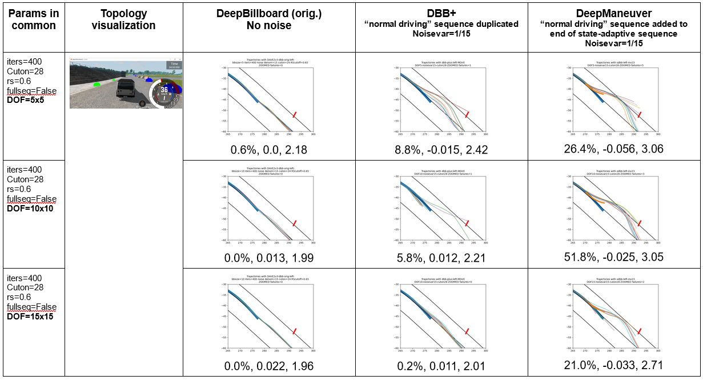
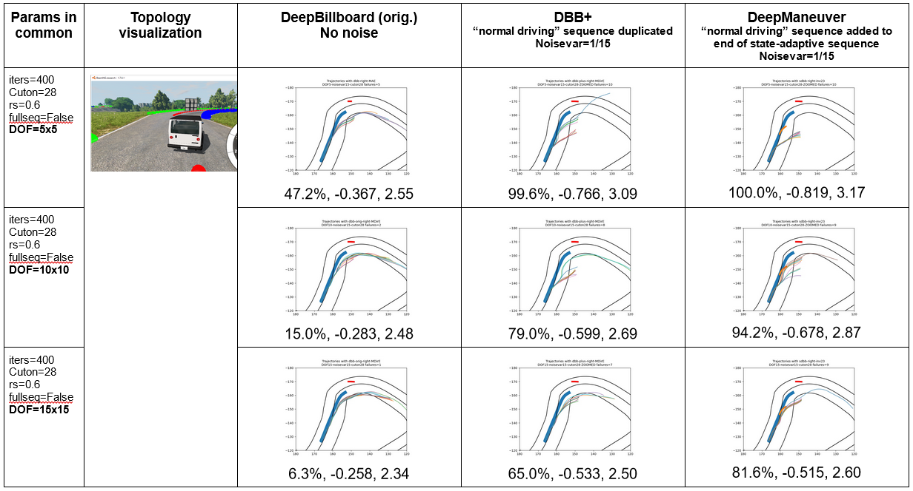
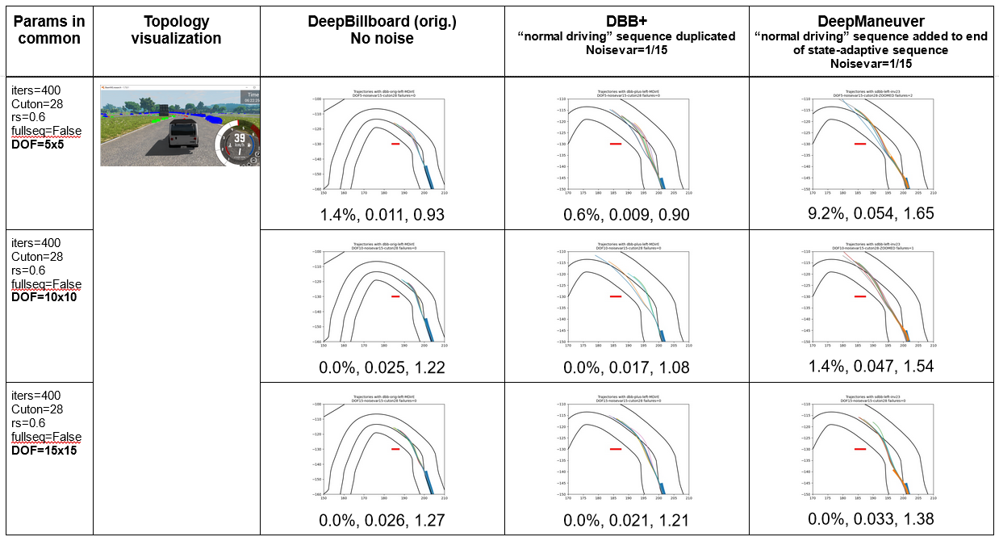
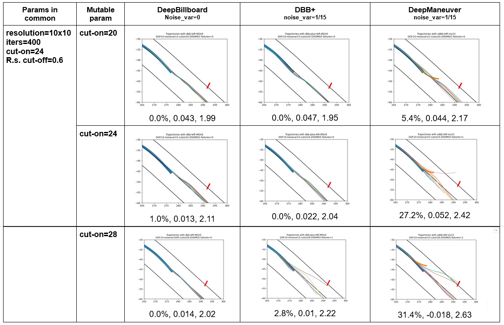
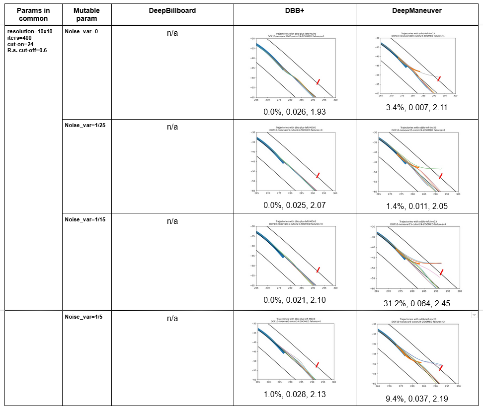

# RQ1: How effective is DeepManeuver at generating perturbations that cause an autonomous vehicle to leave the road? 

To answer this question we compare DeepManeuver against two versions of Deepbillboard, and we also explore the effect of some key parameters.

# Experiment 1: Comparison to DeepBillboard on three topologies

## Topology 1

## Topology 2

## Topology 3

# Experiment 2: Preliminary parameter exploration

## Cut-on

## Noise Variance

