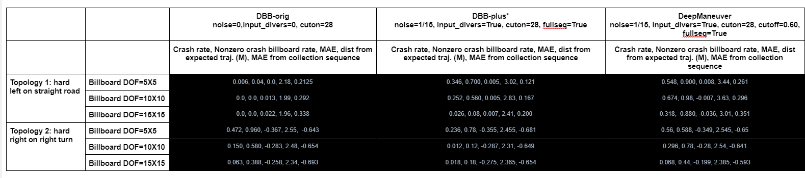
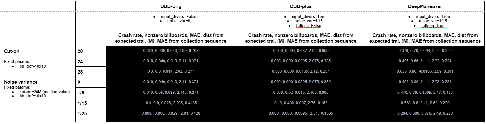
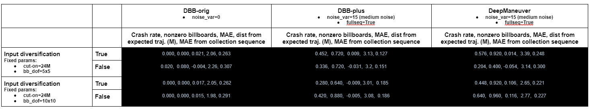

# RQ1: How effective is DeepManeuver at generating perturbations that cause an autonomous vehicle to leave the road? 

To answer this question we compare DeepManeuver against two versions of Deepbillboard, and we also explore the effect of some key parameters.

# Table 1: Fair comparison to Deepbillboard

# Table 2: Preliminary parameter exploration

