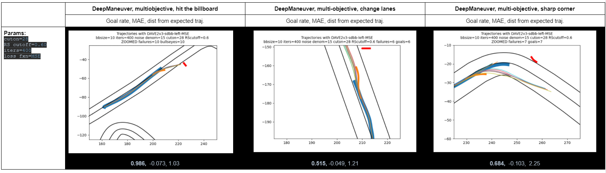

# RQ2: How effective is DeepManeuver at generating perturbations that cause an autonomous vehicle to make maneuvers involving multiple objectives? 

We consider three multi-objectives maneuvers: hitting a target, changing lanes, and cutting a corner.

